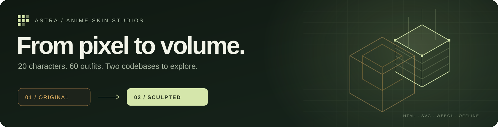
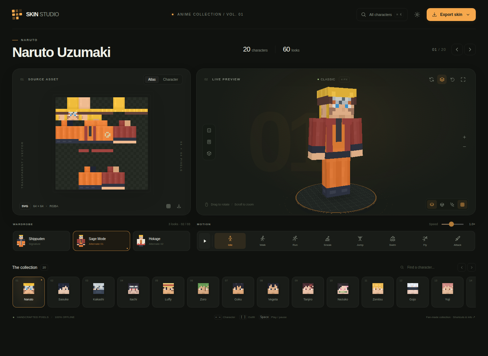
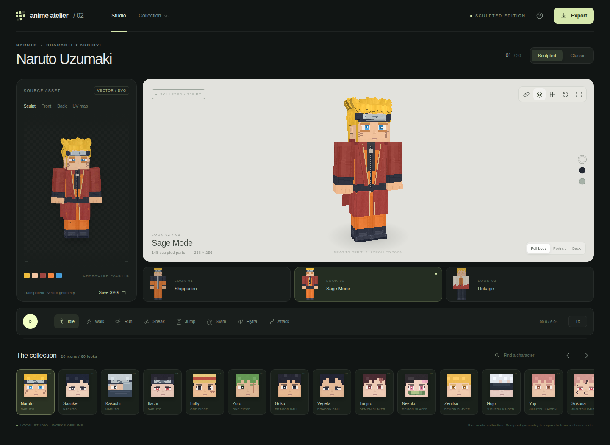
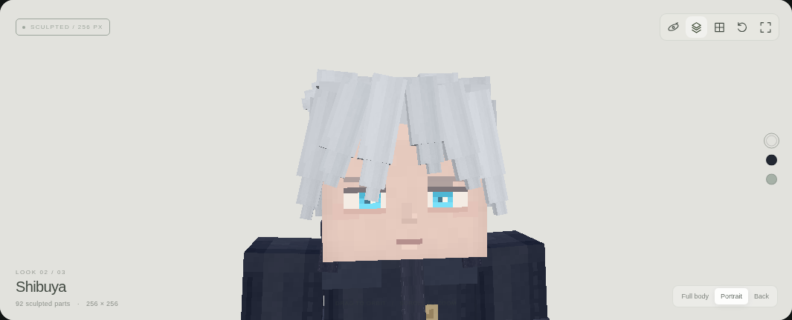

<div align="center">



### Two codebases. The same collection. A visual evolution.

**Standalone HTML** &nbsp; / &nbsp; **Transparent SVG** &nbsp; / &nbsp; **Interactive 3D** &nbsp; / &nbsp; **Offline**

[The two versions](#the-two-versions) · [What changes](#what-changes) · [Getting started](#getting-started) · [Exports](#exports-and-compatibility) · [The collection](#the-collection)

</div>

> [!IMPORTANT]
> **This repository contains two different applications, each in its own HTML file.**
> `Anime_Skin_Studio.html` is the **original version, V1**. `Anime_Atelier_Sculpted.html` is the **improved version, V2**, built from the first one with a redesigned interface, finer textures, and genuine additional 3D volume.
>
> They are not two names for the same file, nor two themes of a single application. Both share a generation base and the same catalog, but they contain distinct visualization code. **V2 does not replace V1: both are kept so they can be used and compared.**

## The two versions

<table>
<tr>
<td width="50%" valign="top">

### 01 · Anime Skin Studio

**The original version**

<a href="Anime_Skin_Studio.html"></a>

A studio focused on the **classic Minecraft skin**: transparent atlas on the left, animated character on the right, with the wardrobe and collection immediately accessible.

64 × 64 textures, outer layers, 3D preview, eight animations, SVG/PNG exports, and ZIP export for the collection.

**[View V1 code](Anime_Skin_Studio.html)** &nbsp; · &nbsp; **[Download V1 HTML](https://github.com/Mirochill/Astra-minecraft-skin/raw/refs/heads/main/Anime_Skin_Studio.html)**

</td>
<td width="50%" valign="top">

### 02 · Anime Atelier Sculpted

**The improved version**

<a href="Anime_Atelier_Sculpted.html"></a>

An evolution toward a **volumetric character atelier**: separate hair strands, sculpted clothing, accessories, and more detailed textures inside a new presentation space.

256 × 256 textures, Sculpted/Classic modes, portrait framing, Chalk/Noir/Sage lighting environments, and animated GLB model export.

**[View V2 code](Anime_Atelier_Sculpted.html)** &nbsp; · &nbsp; **[Download V2 HTML](https://github.com/Mirochill/Astra-minecraft-skin/raw/refs/heads/main/Anime_Atelier_Sculpted.html)**

</td>
</tr>
</table>

<p align="center"><sub>Comparison using the same character and outfit: Naruto Uzumaki · Sage Mode. The previews come from running the actual HTML files.</sub></p>

## What changes

| | V1 · Original | V2 · Sculpted |
| :--- | :--- | :--- |
| **Goal** | Create and explore classic skins. | Rebuild the collection with more detail and volume. |
| **Collection** | 20 characters, three variants each. | The same 20 characters, the same 60 variants, in the same order. |
| **Textures** | 64 × 64 atlas. | Detailed 256 × 256 atlas plus a separate Classic 64 × 64 export. |
| **Hair and clothing** | Details drawn into the texture and outer layers. | Geometric hair strands, collars, lapels, clothing panels, and character-specific accessories. |
| **Visualizer** | Classic studio with Studio/Overworld/Void environments. | New interface with Chalk/Noir/Sage environments and Full body/Portrait/Back framing. |
| **Left-side asset** | Atlas or character, front or back view. | Sculpt, Front, Back, or UV map. |
| **Motion** | Eight Minecraft-inspired animations. | Eight animations plus secondary movement on selected parts. |
| **3D export** | PNG capture of the visualizer. | GLB model with eight animation clips, plus transparent capture. |
| **Standalone** | One HTML file, with no external dependency to load. | Another complete HTML file that does not require V1. |

> [!NOTE]
> The **Classic / Sculpted button inside V2** changes its preview model. It **does not load V1 code**. To use the original studio, open `Anime_Skin_Studio.html`.

### Detail becomes volume



<p align="center"><sub>Satoru Gojo · Shibuya · Sculpted mode. Close-up of the model rendered by the application, not a presentation illustration.</sub></p>

The improvement is not limited to changing the interface palette. V2 adds an articulated model built from distinct parts, finer texture details, and outfit-specific silhouettes. Hair, clothing, and accessories remain visible as the character rotates.

## Getting started

**Download an HTML file, then open it in a browser.** No server, package installation, or API key is required to use the visualizers. Each HTML includes its interface, generation code, rendering engine, and exports.

On GitHub, **View code** opens the source file. Use the **Download HTML** link or the **Download raw file** button, then open the saved file in a browser. For a first look, start with V2; to compare implementations or work with the classic studio, open V1 alongside it.

To clone the entire repository:

```bash
git clone https://github.com/Mirochill/Astra-minecraft-skin.git
cd Astra-minecraft-skin
```

Then open `Anime_Skin_Studio.html` or `Anime_Atelier_Sculpted.html`. The images and JSON files inside `docs/` are used only for documentation; **neither HTML file requires them**.

### Essential controls

| Action | V1 | V2 |
| :--- | :--- | :--- |
| Rotate / zoom | Drag on the model / mouse wheel or pinch. | Drag on the model / mouse wheel or pinch. |
| Change character | Collection or left/right arrows. | Collection or left/right arrows. |
| Change outfit | Wardrobe or `[` and `]` keys. | Wardrobe or `1`, `2`, `3` keys. |
| Choose animation | Buttons or keys `1` through `8`. | Idle, Walk, Run, Sneak, Jump, Swim, Elytra, Attack buttons. |
| Play / pause | `Space` | `Space` |
| Rotate / fullscreen / reset | `R` / `F` / `0` | `R` / `F` / `0` |

The interfaces remain in English and prioritize visual controls. Each application's help button contains its own controls.

## Exports and compatibility

**A flat skin and a sculpted character are two different asset types.** The visualizer lets you view them together, but the exported files are intended for different uses.

| Format | Available in | Use |
| :--- | :--- | :--- |
| **PNG 64 × 64** | V1 and V2 | Skin intended for the Classic / Steve model, with four-pixel-wide arms. |
| **Transparent SVG** | V1 and V2 | Vector atlas and character previews. V2 also adds export of its sculpted projection. |
| **Collection ZIP** | V1 | Exports all 60 skins as PNG and SVG. |
| **PNG / SVG 256 × 256** | V2 | Detailed texture for the atelier model. |
| **Animated GLB** | V2 | Sculpted geometry, texture, and eight animation clips for a compatible 3D tool. |
| **PNG capture** | V1 and V2 | Rendered image; V2 also offers a transparent capture. |

> [!WARNING]
> **V2's additional 3D volume is not carried by a standard Minecraft skin.** A 64 × 64 PNG cannot contain the geometry of hair strands, sheaths, or coat panels. The GLB is not a directly importable Minecraft pack, and the 256 × 256 texture is not presented as a standard Java Edition skin.
>
> The animations are **Minecraft-inspired recreations**, not animation code extracted from the game.

## The collection

**20 characters × 3 outfits = 60 looks per application.** The catalog and its order are identical in both files; these are not 120 different outfits.

<details>
<summary><b>Show the 20 characters and their 60 variants</b></summary>

| # | Character | Variant 1 | Variant 2 | Variant 3 |
| :--- | :--- | :--- | :--- | :--- |
| 01 | Naruto Uzumaki | Shippuden | Sage Mode | Hokage |
| 02 | Sasuke Uchiha | Hebi | Akatsuki | Final Battle |
| 03 | Kakashi Hatake | Jonin | ANBU | Sixth Hokage |
| 04 | Itachi Uchiha | Akatsuki | ANBU | Young Uchiha |
| 05 | Monkey D. Luffy | East Blue | Onigashima | Gear 5 |
| 06 | Roronoa Zoro | Wano | Dressrosa | East Blue |
| 07 | Son Goku | Turtle Gi | Super Saiyan | Ultra Instinct |
| 08 | Vegeta | Battle Armor | Majin | Saiyan Prince |
| 09 | Tanjiro Kamado | Checkered Haori | Final Selection | Training |
| 10 | Nezuko Kamado | Pink Kimono | Awakened | School Uniform |
| 11 | Zenitsu Agatsuma | Thunder Haori | Corps Uniform | School Uniform |
| 12 | Satoru Gojo | Blindfold | Shibuya | Student |
| 13 | Yuji Itadori | Jujutsu Uniform | Training | School Days |
| 14 | Ryomen Sukuna | Cursed Vessel | White Kimono | Domain |
| 15 | Ichigo Kurosaki | Shikai | Bankai | Hollow Mask |
| 16 | Eren Yeager | Scout Regiment | Final Season | Training |
| 17 | Levi Ackerman | Scout Regiment | Captain | Underground |
| 18 | Izuku Midoriya | Hero Costume | U.A. Uniform | Vigilante |
| 19 | Saitama | Hero Suit | Training | Casual |
| 20 | Killua Zoldyck | Classic | Godspeed | Hunter Exam |

</details>

## Two files, two implementations

Character data and part of the skin generation form a shared base. The differences then lie in the interface, enhanced textures, model construction, rendering, animation, and exports. **V2 is genuinely an evolution of V1, not an unrelated project.**

```text
V1: CHARACTERS → createSkin() → 64 × 64 atlas → SkinRenderer
                                               └─ PNG / SVG / ZIP

V2: CHARACTERS → createHD() → 256 × 256 texture → SculptModel
                                                   └─ AtelierRenderer
                                                        └─ SVG / PNG / animated GLB
```

Each application also includes a software fallback renderer when WebGL is unavailable. The sources are bundled inside their respective HTML files, so the styles, generators, and JavaScript can be read and modified directly without a build step.

### Repository structure

```text
Astra-minecraft-skin/
├── Anime_Skin_Studio.html          # V1: complete original application
├── Anime_Atelier_Sculpted.html     # V2: complete improved application
├── index.html                     # Previous V1 entry point, kept unchanged
├── README.md
└── docs/
    ├── assets/                    # Banner and real application screenshots
    ├── manifest.json              # Sizes and SHA-256 hashes of both HTML files
    └── validation.json            # Verification results and scope
```

`index.html` is the previous compressed V1 wrapper already present in the repository. It remains unchanged to preserve that entry point. **It is not a third edition.** The two full sources to compare are the explicitly named HTML files above.

## Verification and limitations

The publication preserves both provided files **byte for byte**, with hashes stored in [`docs/manifest.json`](docs/manifest.json). JavaScript syntax, the presence of all 20 characters and 60 variants, the identity of their order and names, and preview rendering were verified. The screenshots were captured in Chromium using the software fallback renderer, with no external network request from the application and no uncaught JavaScript error during those checks.

Details are available in [`docs/validation.json`](docs/validation.json). These tests do not constitute exhaustive validation of hardware WebGL rendering, every interaction and export combination, or importing the skins into the Minecraft client or the GLB files into third-party 3D software. No “×100” quality or performance multiplier is claimed as a technical measurement.

---

<div align="center">

**One collection, two stages of creation.**  
The classic skin as the starting point. The sculpted character as the evolution.

<sub>Independent fan-made project. The depicted characters and referenced trademarks belong to their respective owners. This project is neither official nor affiliated with Mojang, Microsoft, or the rights holders of the represented works.</sub>

</div>
